# online clock

[Site Link](https://online-clock-stopwatch-timer.netlify.app/)

I followed the Open Source Coding Youtube channel's video titled "Digital Clock using HTML CSS & JavaScript | Javascript Stopwatch and Timer". I made additions myself. The design belongs to me.

[video address](https://www.youtube.com/watch?v=7k6kNuGKlEo)

 

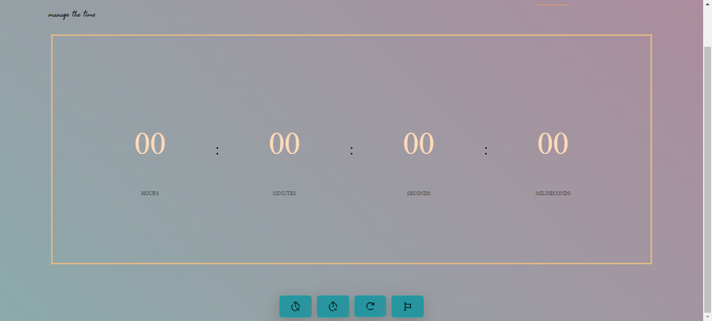

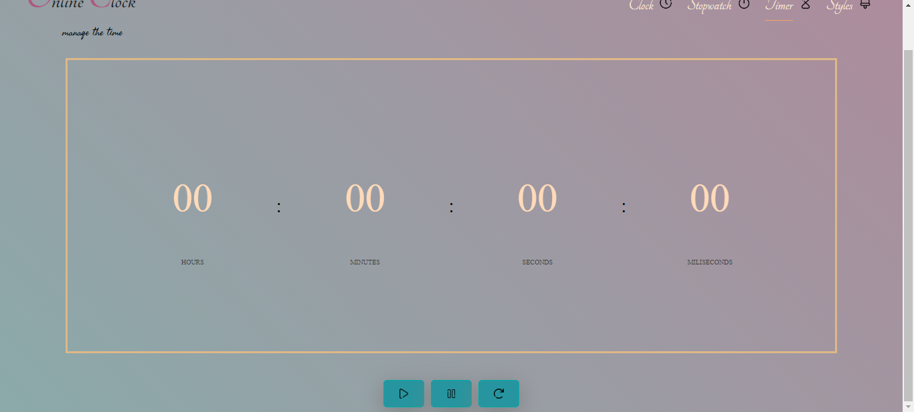

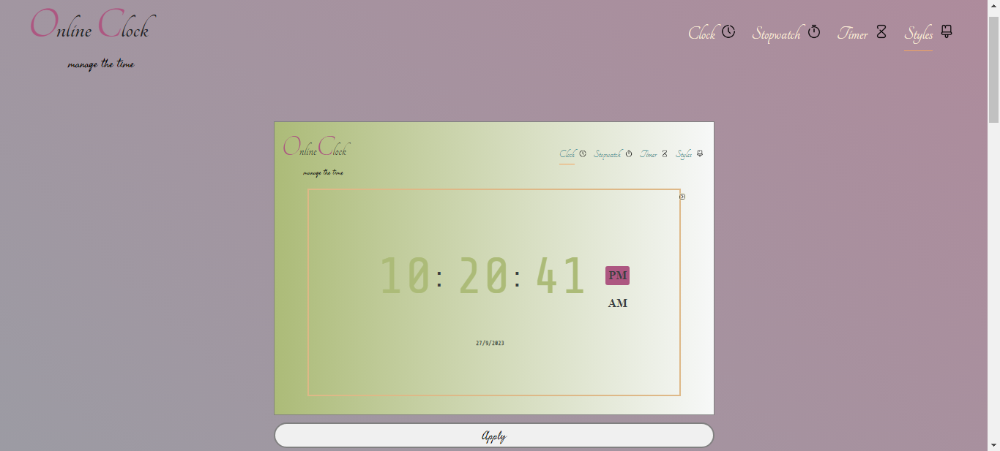

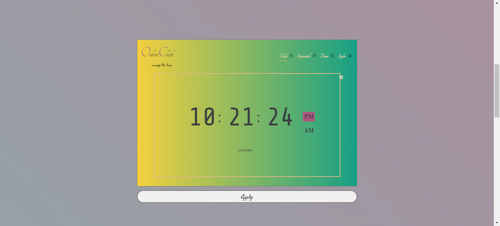

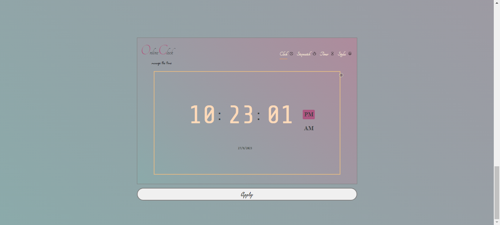

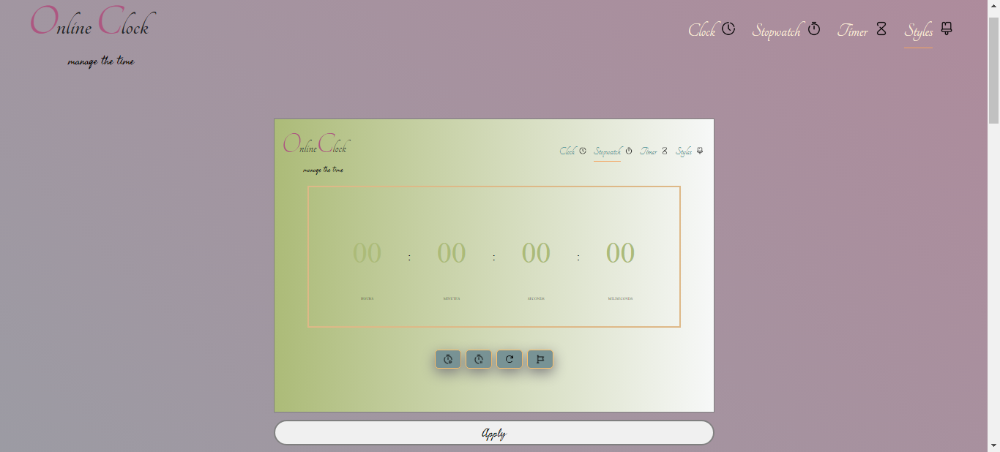

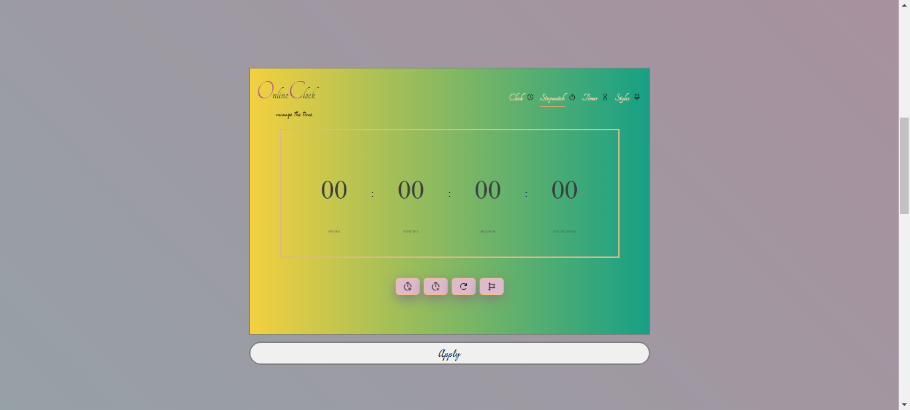

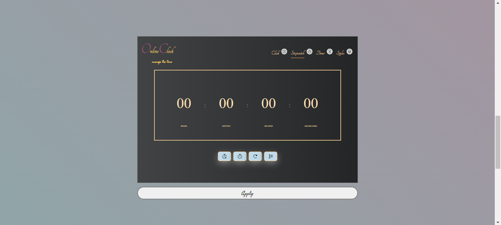

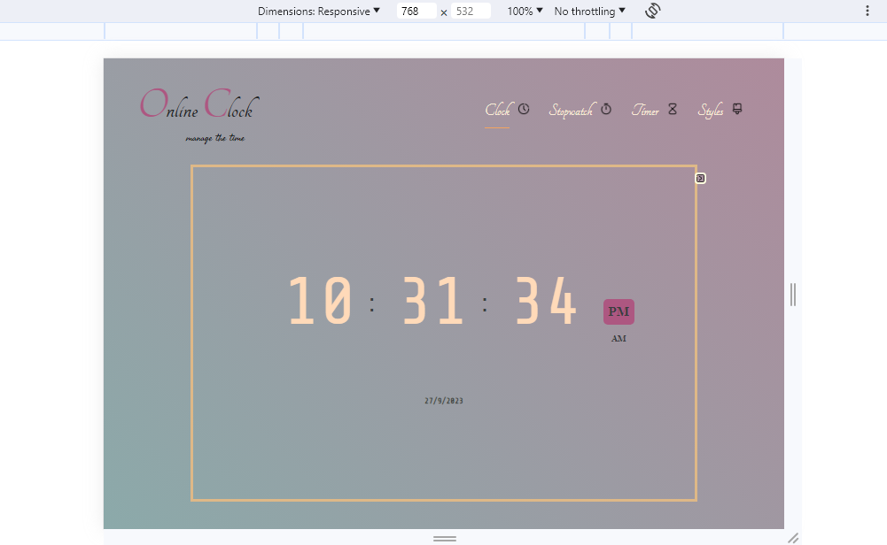

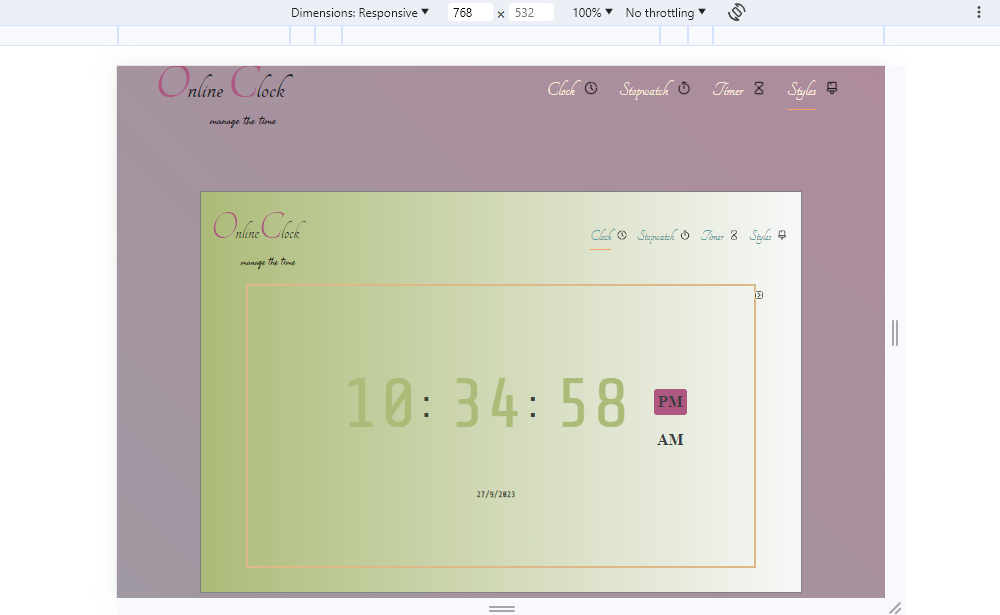

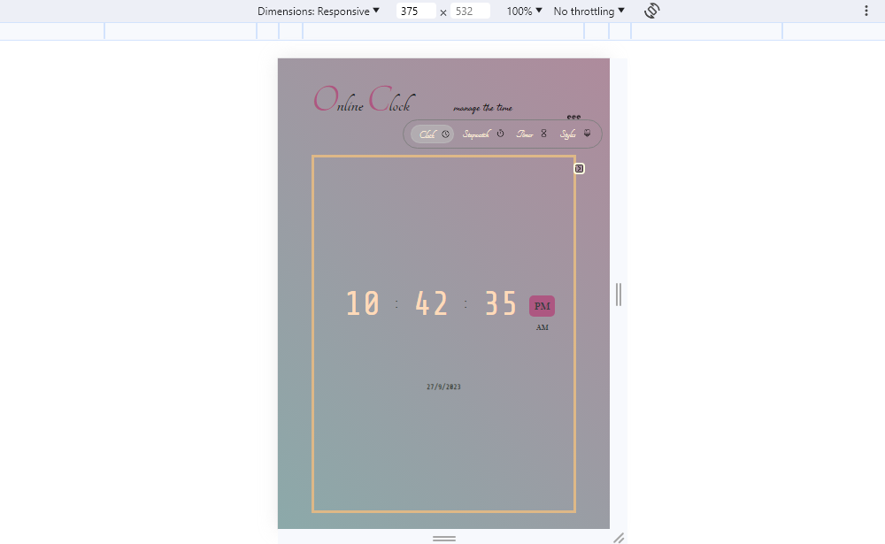

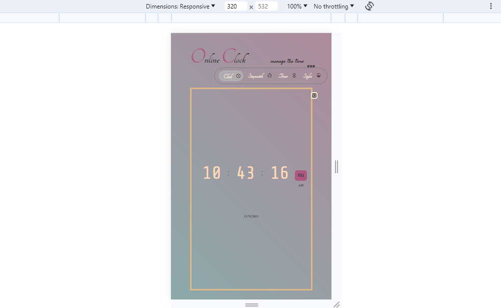
